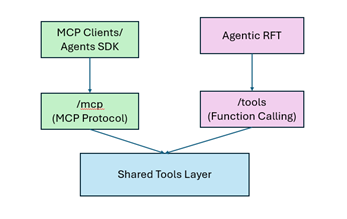

# Reinforcement Fine-Tuning (RFT): Best Practices

This document provides best practices to help customers successfully apply Reinforcement Fine‑Tuning (RFT) to improve model performance on well‑defined, objectively scorable tasks.

## Table of Contents

- [When to Use RFT](#when-to-use-rft)
- [Getting Started](#getting-started)
- [Common User Errors](#common-user-errors)
- [Advanced Scenarios](#advanced-scenarios)


## When to Use RFT

Use Reinforcement Fine-Tuning (RFT) to improve **reasoning accuracy and decision quality** in tasks where outputs can be **clearly evaluated and scored**.

RFT is especially useful in scenarios where outputs can be judged with **clear, objective criteria**—for example:
- Improving tool-calling accuracy
- Enforcing a policy or rubric
- Extracting structured data where correctness can be unambiguously scored

Do **not** use RFT for format, tone, or stylistic improvements. Prefer **prompt engineering**, **structured outputs**, or **supervised fine-tuning (SFT)** for those scenarios.

## Getting Started

### Define the Objective

Start by clearly stating the task and what success looks like, then design a grader that reflects real task quality as reliably as possible.

### Establish a Baseline

Before training, run a baseline evaluation using your grader on a small set of examples—typically **10–100 samples**—so you understand starting performance and can measure real improvement.

A good starting point is evaluating a base model (for example, GPT‑5.x) and experimenting with system prompts to reach the best possible performance before fine-tuning. Learn more about [Foundry Evaluation](https://learn.microsoft.com/en-us/azure/foundry/how-to/evaluate-generative-ai-app). [ZavaRetailAgent](../ZavaRetailAgent/) is an E2E sample from setting up baseline of base model to SFT, and then to RFT.

### Design Effective Graders

The grader is the primary driver of RFT success. Invest disproportionate effort in getting it right.

- **Use the simplest grader that works**: If validating an exact match answer (for example, a number or multiple‑choice letter), use a **string‑match grader** rather than a model‑based or Python grader — even if those alternatives could also work.
- **Prefer deterministic checks**: String validation, code or Python‑based graders, and endpoint‑based graders are more reliable than model‑based grading.
- **Aim for well‑distributed rewards**: Rewards that are too sparse or too uniform produce weak learning signals that limit model improvement.
- **Validate on diverse, real‑world inputs**: Use [Foundry evaluations](https://learn.microsoft.com/en-us/azure/foundry/how-to/evaluate-generative-ai-app) to test graders on existing datasets to ensure they behave as expected.

### Start Small and Iterate

Begin with small datasets (10–100 samples), simple graders, and low epoch counts. A practical workflow is to start with **o4‑mini RFT** to validate the end‑to‑end setup and grader behavior, then graduate to **GPT‑5 RFT** once the reward signal and training loop look healthy.

### Tune Training Parameters

Expect `epoch count` and `compute_multiplier` to have the most impact on quality. Change **one variable at a time** so gains or regressions can be clearly attributed.

### Build Scenario-Specific Tools for Complete Workflows

Don't reuse existing tools that only cover part of your workflow. If a tool wasn't designed for your specific scenario, it may skip critical steps and give the model an incomplete learning signal.

Instead, build tools that reflect the full decision-making cycle your task requires: For example, an automatic escalation workflow shouldn't just have a tool to trigger escalation — it also needs a tool to check recipient availability first. Without that step, the model never learns when escalation is appropriate, only how to fire it.


### Monitor eval metrics and outputs to detect reward hacking

Don't wait for final scores — inspect outputs and evaluation metrics **throughout training**. You can monitor intermediate results in the **Metrics** tab on the fine-tuning job detail page in Foundry, which shows eval scores at each checkpoint. 

If scores improve while visible output quality degrades, or if the model produces responses that "match" the grader without performing the intended behavior (such as a semantically incorrect tool call that still passes pattern checks), you may be seeing reward hacking. 

Use held out evaluation sets with diverse, real world inputs to catch these failures early.

When tool calling accuracy is the goal, explicitly verify that the model is emitting well formed, semantically correct tool calls.

## Common User Errors

### Improperly Formatted Data

RFT requires data to be in a specific format – RFT requires that the final message in a line can only be “User” or “Developer” role.

For example, in **SFT** (supervised fine-tune), you might have a data row look like this where final message is “Assistant” role:

```json
{
    "messages": [
        { 
            "role": "system", 
            "content": "Reply user's question as accurately as possible." 
        },
        { 
            "role": "user", 
            "content": "Question: What is the capital of France?" 
        },
        {
            "role": "assistant",
            "content": "Paris"
        }
    ]
  
}
```

In this case, the preferred answer is given as the final “assistant” message. To use this same data for **RFT**, you would have to modify the data structure to be the following:

```json
{
    "messages": [
        { 
            "role": "developer", 
            "content": "Reply user's question as accurately as possible." 
        },
        { 
            "role": "user", 
            "content": "Question: What is the capital of France?" 
        }
    ],
    "reference_answer": "Paris"
}
```

Now, instead of the answer being given in an assistant message, it is given in a separate “reference_answer” key, which can be referred to in the grader as the ground truth for a given item. You can provide zero or more “top level” keys like “reference_answer” for use in your grader.

### Data and Grader Mismatch

RFT not only has a new data format, but each dataset needs to be carefully matched with a grader so it is easy to have failures when the grader and data do not agree. Graders can reference any key within your data by using the “item” namespace, such as “item.reference_answer” or “item.answer”, but any key that is referenced must be in all data rows. The grader can also reference the model’s output using the “sample” namespace,  such as “sample.output_text”. If you want to reference structured output via the “sample.output_json”, you must also provide a response format during job creation. 

The following is an example of a mismatched grader and data:

```json
{
    "messages": [
        { 
            "role": "developer", 
            "content": "Reply user's question as accurately as possible." 
        },
        { 
            "role": "user", 
            "content": "Question: What is the capital of France?" 
        }
    ],
    "reference_answer": "Paris"
}
```

```json
{
    "type": "string_check",
    "name": "invalid-grader",
    "input": "{{sample.output_text}}",
    "reference": "{{item.capital}}", //should be {{item.reference_answer}}
    "operation": "eq"
}     
```


### Missing Response Format

Getting your FT model to respond in a repeatable way can be done with the system prompt you can provide in your data, but often that is not enough. To enforce a structured response, provide a response format in your job definition to restrict the models output and allow use of the “sample.output_json” namespace in your grader. Your response format must exclude explicit definitions for properties – fields defined with a “$ref” will not be properly resolved.

Here is an example of a data row, response format, and grader that agree. Note that not all fields in the data/response format are used in the grader, that the grader is only able to use the “sample.output_json.capital” because the response format is provided, and that in this case the model will only be graded on the capital answer, not the population, because population is not referenced by the grader:


```json
{
    "messages": [
        { 
            "role": "developer", 
            "content": "Reply user's question as accurately as possible." 
        },
        { 
            "role": "user", 
            "content": "Question: What is the capital of France? What is its population" 
        }
    ],
    "capital": "Paris",
    "population": "2148000"
    
}
```

```json

{
    "type": "string_check",
    "name": "invalid-grader",
    "input": "{{sample.output_json.capital}}",
    "reference": "{{item.capital}}",
    "operation": "eq"
}
```

```json
{
    "type": "json_schema",
    "json_schema": {
        "name": "response",
        "strict": true,
        "schema": {
            "properties": {
                "capital": {
                    "title": "Capital",
                    "type": "string",
                },
                "population": {
                    "title": "Population",
                    "type": "string"
                }
            },
            "title": "CapitalData",
            "type": "object",
            "additionalProperties": false
        }
    }  
}
```


## Advanced Scenarios

### Tool Design

Start by treating tools as part of the environment, not as “helpers.” If your use case involves slight variations in core workflow that depend on a runtime input than the easiest way to keep training prompts stable is to make them **data-driven**: have a tool return the metadata about runtime input like the required fields, constraints, and allowed next actions as structured data. That way, adding a new workflow is a schema/data update—not a prompt rewrite or training update.

Assume training creates bursty traffic to your tools: set timeouts and rate limits, add tracing (latency + error codes), and design retry behavior so a few slow calls don’t cascade into a retry storm.

### MCP Server

RFT pipeline supports tool use through function-calling, however MCP is preferred choice when building agentic system. To solve this problem, implement each tool once, then expose it two ways—via MCP (\mcp) for MCP-native clients and via a **function-calling-compatible** (\tools) interface for finetuning. This hybrid implementation can seamlessly integrate with Agents, Evaluations and Reinforcement finetuning on Foundry platform.



### Grader Robustness and Reward Integrity

Bad graders can lead models to learn shortcuts (reward hacking). Don’t grade only the final text, grade the tool trace and verify outcomes. In practice that means giving partial credit (outcome vs. tool use vs. safety), explicitly requiring critical steps (for example, lookups before writes), and keeping grading deterministic so improvements reflect policy changes , not grader noise.